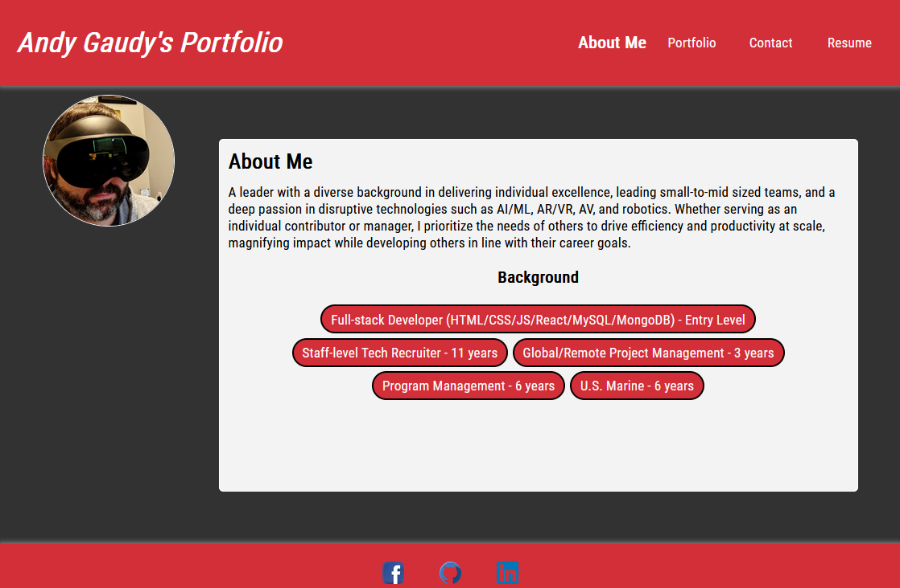
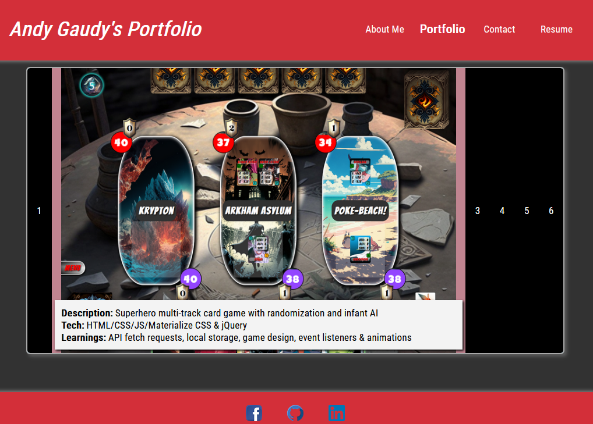

# react-portfolio 

## Description

This is a single-page React application built to showcase my learnings and progress through bootcamp.  It uses conditional rendering and components to quickly update and load the application based on user behavior and actions.  It was challenging to make the page fully responsive, but my taking a mobile-first design approach, components fit into the overall layout very nicely.

## Table of Contents

- [Installation](#installation)
- [Usage](#usage)
- [License](#license)
- [Contributing](#contributing)
- [Tests](#tests)
- [Questions](#questions)

## Installation

No installation required.

## Usage

You can visit the live application at https://maximusDecimalusMeridius.github.io/react-portfolio.

## License

MIT License - Please refer to the LICENSE in the repo.

## Contributing

N/A

## Tests

N/A

## Questions

You can view my Github @ https://www.github.com/maximusDecimalusMeridius  
OR  
Email me with questions @ [andygg_dev@yahoo.com](mailto:andygg_dev@yahoo.com?subject=Question%20About%20react-portfolio%20App)
    